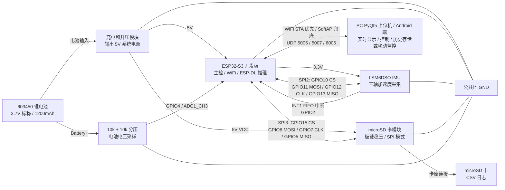

# ESP32-S3 山羊行为智能监测系统技术说明

> 版本：源码校准版  
> 更新时间：2026-05-23  
> 适用范围：用于技术论文、研电赛说明材料、答辩讲稿和项目复现。  
> 校准依据：本说明重新依据 `SPI/main` 固件源码、`train` 训练脚本、`SPI/main` PC 上位机程序、`android_app` Android 端代码、打包脚本和当前实物接线整理，不直接沿用旧文档中的硬件描述。特别注意：**当前 microSD 模块 VCC 接 5V，不是接 3.3V**；LSM6DSO 传感器仍接 3.3V。

---

## 1. 项目概述

本项目设计并实现了一套基于 ESP32-S3 的山羊行为智能监测系统。系统使用佩戴式惯性传感器采集三轴加速度数据，在 ESP32-S3 端完成轻量化卷积神经网络推理，并通过 WiFi 外部热点优先、SoftAP 兜底的 UDP 通信方式与 PC 上位机或 Android 监控端交互，实现行为识别、按需实时波形显示、电池估算、SD 卡日志记录、SQLite 历史存储和健康风险提示。

系统的核心思路是：不依赖摄像头和云端服务器，而是在低成本嵌入式设备上直接运行行为识别模型。佩戴端负责传感器采集、边缘 AI 推理、UDP 广播/单播推送和本地日志；PC 上位机负责可视化、控制、行为统计、健康评分和历史分析；Android 端提供移动端监听、控制、波形开关和轻量统计展示。

本系统当前识别 5 类行为：

| 类别索引 | 模型标签 | 中文含义 | 典型加速度表现 |
|---:|---|---|---|
| 0 | `Displacement` | 位移、走动 | 三轴加速度存在较明显周期性或大幅变化 |
| 1 | `Grazing` | 采食、吃草 | 头部小幅重复运动，波形较规律 |
| 2 | `Ruminating_Chewing` | 反刍、咀嚼 | 微弱而规律的周期性运动 |
| 3 | `Other` | 其他活动 | 不规则运动或难以归入其他类别的活动 |
| 4 | `Resting` | 休息、静止 | 三轴变化较小，整体接近稳定 |

---

## 2. 系统总体架构

系统由佩戴端硬件、嵌入式固件、PC 上位机、Android 监控端和训练部署流水线组成。

```text
三轴加速度数据
    |
    v
LSM6DSO IMU  --SPI2-->  ESP32-S3
                         |
                         | 1. 原始 26 Hz 数据
                         |    -> 收到 ACCELON 后经 UDP 5007 发送实时波形
                         |    -> SD 卡 CSV 日志
                         |
                         | 2. 26 Hz -> 24.4 Hz 线性重采样
                         |    -> 120 点滑动窗口
                         |    -> 4 通道输入 X/Y/Z/|a|
                         |    -> ESP-DL INT8 CNN 推理
                         |
                         | 3. 推理结果
                         |    -> UDP 5005 行为结果
                         |    -> SD 卡 CSV 日志
                         |
                         v
                 WiFi STA 优先接入主/备外部热点
                 STA 失败后 SoftAP 兜底: LXSPI-ESP32S3
                         |
                         v
PC PyQt5 上位机 / Android 原生监控端
    |
    |-- 按需实时三轴波形
    |-- 当前行为、置信度、类别得分
    |-- 行为统计、健康评分、风险告警
    |-- PC 端运行时生成 SQLite 历史库
    |-- PC 端历史查看和 CSV 导出
    |-- Android 端移动监听、控制和波形开关
```

佩戴端和上位端之间使用 UDP。当前固件优先让 ESP32-S3 作为 Station 接入手机或 PC 开启的 2.4 GHz 外部热点，并支持主热点和备用热点轮换；若所有配置的 STA 网络连续失败，则自动打开板端 SoftAP `LXSPI-ESP32S3` 作为兜底通道。PC 上位机和 Android 端监听 UDP 广播并根据数据包中的设备编号和发送端 IP 自动发现设备。

| 通道 | 方向 | 端口 | 作用 |
|---|---|---:|---|
| 推理结果 | ESP32-S3 -> PC/Android | 5005 | 发送当前行为、置信度、各类分数、电池估算和 SD 状态 |
| 加速度波形 | ESP32-S3 -> PC/Android | 5007 | 收到 `ACCELON` 后发送原始三轴加速度数组和 SD 状态；`ACCELOFF` 后停止波形流 |
| 控制命令 | PC/Android -> ESP32-S3 | 6006 | 发送启动、暂停、波形开关、重挂载 SD、同步时间和复位命令 |

---

## 3. 硬件组成与真实接线

### 3.1 硬件总体框架图



图中电源链路和信号链路需要分开理解：升压模块提供 5V 系统电源，ESP32-S3 开发板再给 LSM6DSO 提供 3.3V；当前 microSD 模块因带板载稳压器，VCC 接 5V。所有模块必须共地，SPI 信号仍按 ESP32-S3 的 3.3V GPIO 电平连接。

### 3.2 硬件模块

当前系统使用的主要硬件如下：

| 模块 | 当前用途 | 关键说明 |
|---|---|---|
| ESP32-S3 开发板 | 主控、WiFi STA/SoftAP、模型推理、SPI 采集、SD 记录 | 固件目标为 `esp32s3`，Flash 配置为 8MB，PSRAM 已启用 |
| LSM6DSO IMU | 三轴加速度采集 | SPI 模式 3，1 MHz，3.3V 供电，INT1 中断 |
| microSD 卡模块 | 本地 CSV 日志 | 当前实物模块 VCC 接 5V；SPI IO 接 ESP32-S3 的 3.3V GPIO |
| microSD 卡 | 保存日志文件 | FAT 文件系统，日志目录 `/sdcard/logs` |
| 锂电池 | 便携供电 | 当前电池为 603450，3.7V 标称，1200mAh |
| 电池电压分压 | 电压估算 | 两个 10k 电阻等分，分压点接 GPIO4 / ADC1_CH3 |
| 充电和升压模块 | 充电与 5V 系统供电 | 实物使用时应保证所有模块共地，ESP32 与传感器使用安全电平 |

说明：3.7V 是锂电池标称电压，不是满电电压。单节锂电池满电通常接近 4.2V；系统中显示的是基于运行中负载电压的“电池估算”，不是库仑计意义上的精确 SOC。

### 3.3 GPIO 分配

当前固件中的 GPIO 定义如下。

| GPIO | 连接对象 | 方向/接口 | 固件宏或位置 | 说明 |
|---:|---|---|---|---|
| GPIO2 | LSM6DSO INT1 | 输入中断 | `PIN_NUM_INT1` | FIFO 水位中断，上升沿触发 |
| GPIO4 | 电池分压点 | ADC 输入 | `BATTERY_ADC_CHANNEL ADC_CHANNEL_3` | ADC1_CH3，读取电池电压的一半 |
| GPIO5 | SD DO / MISO | SPI3 MISO | `SD_PIN_MISO` | SD 卡数据输出到 ESP32 |
| GPIO6 | SD DI / MOSI | SPI3 MOSI | `SD_PIN_MOSI` | ESP32 输出到 SD 卡 |
| GPIO7 | SD CLK / SCK | SPI3 CLK | `SD_PIN_CLK` | SD 卡 SPI 时钟 |
| GPIO10 | LSM6DSO CS | SPI2 CS | `PIN_NUM_CS` | LSM6DSO 片选 |
| GPIO11 | LSM6DSO MOSI | SPI2 MOSI | `PIN_NUM_MOSI` | ESP32 输出到 LSM6DSO |
| GPIO12 | LSM6DSO CLK | SPI2 CLK | `PIN_NUM_CLK` | LSM6DSO SPI 时钟 |
| GPIO13 | LSM6DSO MISO | SPI2 MISO | `PIN_NUM_MISO` | LSM6DSO 输出到 ESP32 |
| GPIO15 | SD CS | SPI3 CS | `SD_PIN_CS` | SD 卡片选 |

GPIO2 用于 LSM6DSO INT1，是为了避开 GPIO4 的电池 ADC 分压输入。此前若把 INT1 和电池 ADC 共用到 GPIO4，会导致中断和电压采样功能互相冲突。

### 3.4 LSM6DSO 接线

LSM6DSO 当前使用 SPI2 总线，必须使用 3.3V 供电。

| LSM6DSO 引脚 | ESP32-S3 引脚 | 说明 |
|---|---:|---|
| VCC | 3.3V | LSM6DSO 模块供电，不能接 5V |
| GND | GND | 与 ESP32-S3 共地 |
| SDO / MISO | GPIO13 | 传感器输出 |
| SDA / MOSI | GPIO11 | 主机输出 |
| SCL / SCLK | GPIO12 | SPI 时钟 |
| CS | GPIO10 | 低电平片选 |
| INT1 | GPIO2 | FIFO 水位中断 |

固件中 LSM6DSO 的 SPI 参数为：

| 参数 | 当前值 |
|---|---|
| SPI host | `SPI2_HOST` |
| SPI mode | 3 |
| SPI clock | 1 MHz |
| 加速度量程 | ±2g |
| 加速度灵敏度 | 0.061 mg/LSB，即 `0.061 / 1000.0 g/LSB` |
| 加速度 ODR | 26 Hz |
| FIFO BDR | 26 Hz |
| FIFO watermark | 13 samples |
| FIFO 模式 | Continuous |
| 中断路由 | `INT1_FIFO_TH` 到 INT1 |

### 3.5 microSD 卡接线

当前实物使用的是带板载稳压器的 microSD 卡模块。该模块的 VCC 接 5V。不要把当前实物写成 SD 模块 VCC 接 3.3V。

| SD 模块引脚 | ESP32-S3 引脚 | 说明 |
|---|---:|---|
| VCC | 5V | 当前模块 VCC 接 5V，板载稳压后给卡供电 |
| GND | GND | 与 ESP32-S3 共地 |
| DO / MISO | GPIO5 | SD 输出到 ESP32 |
| DI / MOSI | GPIO6 | ESP32 输出到 SD |
| CLK / SCK | GPIO7 | SPI 时钟 |
| CS | GPIO15 | 片选 |

注意：

1. 当前模块 VCC 接 5V，是因为实物模块带板载稳压器，若直接把模块 VCC 接 3.3V 可能因稳压器压降导致卡端电压不足。
2. SD 卡本体的工作电压仍应约为 3.3V。当前接 5V 指的是模块 VCC 输入，不等于把裸 SD 卡电源接 5V。
3. 若更换为裸卡座或无稳压模块，应按该硬件模块规格接 3.3V，并确认所有 IO 电平安全。
4. SPI 信号线必须尽量短，所有模块必须共地。若出现 `ESP_ERR_TIMEOUT`、`ESP_ERR_INVALID_RESPONSE` 或 MISO 空闲电平异常，应优先检查供电、卡座接触、DO/MISO 接线和 FAT32 格式。

当前固件中 SD 卡 SPI 参数为：

| 参数 | 当前值 |
|---|---|
| SPI host | `SPI3_HOST` |
| 初始化方式 | SDSPI |
| 最大 SPI 频率 | 400 kHz |
| mount point | `/sdcard` |
| 日志目录 | `/sdcard/logs` |
| 文件名格式 | `YYYYMMDD_HHMMSS.csv` |
| mount attempts | 2 次 |
| retry delay | 250 ms |
| 写缓冲 | 4096 bytes |
| flush/fsync 间隔 | 1000 ms，推理结果写入时也会同步 |

### 3.6 电池电压采样电路

当前使用两个 10k 电阻构成 1:1 分压：

```text
Battery+  ->  10k  ->  GPIO4 / ADC1_CH3  ->  10k  ->  GND
```

因此 GPIO4 上的电压理论上为电池电压的一半。固件会读取 GPIO4 的 ADC 电压，再乘以分压比 2.0 还原电池电压。

当前电池估算代码参数如下：

| 参数 | 当前值 | 来源 |
|---|---:|---|
| ADC 通道 | ADC1_CH3 / GPIO4 | `BATTERY_ADC_CHANNEL` |
| ADC 衰减 | `ADC_ATTEN_DB_12` | `BATTERY_ADC_ATTEN` |
| ADC 位宽 | 12 bit | `BATTERY_ADC_WIDTH` |
| 分压比 | 2.0 | 两个 10k 电阻等分 |
| 采样次数 | 16 | 多次采样取平均 |
| 校准增益 | 1.018 | 由实测 4.03-4.04V 与 ADC 还原 3.95-3.98V 得出 |
| 校准偏移 | 0 mV | 当前未使用偏移 |
| 电压显示范围 | 3000-4200 mV | 低于或高于时限幅 |

当前百分比曲线是负载状态下的经验估算：

| 电池电压范围 | 显示百分比 |
|---|---|
| ≥ 4050 mV | 100% |
| 4000-4050 mV | 90%-100% |
| 3900-4000 mV | 75%-90% |
| 3800-3900 mV | 55%-75% |
| 3700-3800 mV | 35%-55% |
| 3600-3700 mV | 20%-35% |
| 3500-3600 mV | 10%-20% |
| 3300-3500 mV | 0%-10% |
| < 3300 mV | 0% |

论文中应表述为“基于电压的电量估算”，不要表述为精密电量计。若后续需要更准确的电量百分比，应增加专用电量计或库仑计芯片。

---

## 4. 固件总体设计

固件位于 `SPI/main`，基于 ESP-IDF 5.5.2 开发，使用 C/C++ 混合实现。

| 文件 | 功能 |
|---|---|
| `main.c` | 系统入口、任务创建、控制命令处理、传感器读取、UDP 发送、重采样和推理调度 |
| `lsm6dso.c/.h` | LSM6DSO SPI 驱动、寄存器读写、FIFO 初始化、故障恢复 |
| `goat_behavior_model.cpp/.h` | ESP-DL 模型加载、输入预处理、推理执行、输出解析 |
| `sd_logger.c/.h` | SD 卡挂载、CSV 会话创建、加速度和推理结果记录 |
| `wifi_manager.c/.h` | WiFi 外部热点优先接入、SoftAP 兜底、设备编号生成、UDP 广播地址和 STA 网关单播目标生成 |
| `battery_monitor.c/.h` | ADC 校准、采样、分压还原、电池百分比估算 |
| `model/model_norm.h` | 模型输入通道数、窗口长度、归一化标准差、类别标签 |
| `model/goat_cnn_5cls_s3_int8.espdl` | INT8 ESP-DL 模型文件，编译时嵌入固件 |

固件组件配置见 `SPI/main/CMakeLists.txt`：

- 参与编译的源码：`main.c`、`lsm6dso.c`、`goat_behavior_model.cpp`、`sd_logger.c`、`battery_monitor.c`、`wifi_manager.c`
- 依赖组件：`driver`、`esp_wifi`、`nvs_flash`、`esp_timer`、`esp_adc`、`esp_pm`、`esp_system`、`fatfs`、`vfs`、`sdmmc`
- 模型文件嵌入：`EMBED_FILES "model/goat_cnn_5cls_s3_int8.espdl"`
- 直接依赖：`espressif/esp-dl` 3.3.0

分区表 `SPI/partitions.csv`：

| 分区 | 类型 | 偏移 | 大小 |
|---|---|---:|---:|
| `nvs` | data/nvs | 0x9000 | 0x6000 |
| `phy_init` | data/phy | 0xf000 | 0x1000 |
| `factory` | app/factory | 0x10000 | 0x200000 |

当前一次构建生成的 `SPI.bin` 大小约 1,882,928 bytes，适配 0x200000 的 factory 分区。

### 4.1 启动流程

`app_main()` 的启动顺序如下：

1. 设置时区为 `CST-8`，用于北京时间文件名和 CSV 时间列。
2. 初始化 NVS。
3. 创建 `stream_mutex`，保护采集开关和时间同步变量。
4. 配置电源管理：启用 DFS，CPU 在 40-160 MHz 动态调整；关闭 Light Sleep。
5. 初始化 ESP-DL 行为识别模型。
6. 构造全零窗口进行一次 warmup 推理，提前完成模型内部内存分配。
7. 启动 WiFi：若 `WIFI_STA_SSID` 或 `WIFI_STA_BACKUP_SSID` 已配置，则按主热点、备用热点顺序尝试连接；所有配置的 STA 网络连续失败后打开 SoftAP 兜底；若两个 STA SSID 均为空，则直接进入 SoftAP-only 模式。
8. 初始化电池 ADC。
9. 初始化 SD 卡；若失败则继续运行，只是没有本地 SD 日志。
10. 创建 UDP 推理 socket 和加速度 socket，均启用广播，并设置发送超时 100 ms；加速度 5007 波形流默认关闭，收到 `ACCELON` 后才发送原始波形包。
11. 初始化 SPI2 总线和 LSM6DSO。
12. 配置 GPIO2 中断，上升沿触发。
13. 创建 `LSM_TASK` 和 `CTRL_TASK`。

模型初始化放在 WiFi 初始化之前，是为了在 WiFi 占用较多内部 SRAM 前完成 ESP-DL 模型及其缓冲区分配。warmup 推理也是生产路径的一部分，用于降低首次真实推理时出现 SIMD 内存分配失败的风险。当前源码中 `g_stream_enabled` 初始为 `true`，因此设备上电后会开始传感器采集和推理广播；`START` 的实际作用是恢复被 `PAUSE` 关闭的采集流，并在需要时启动新的 SD 记录会话。

### 4.2 FreeRTOS 任务划分

| 任务 | Core | 优先级 | 栈大小 | 职责 |
|---|---:|---:|---:|---|
| `LSM_TASK` | 1 | 10 | 8192 bytes | 读取 LSM6DSO FIFO、按需发送加速度包、重采样、模型推理、发送推理包、写 SD |
| `CTRL_TASK` | 0 | 9 | 4096 bytes | 监听 PC/Android 端控制命令、启动/暂停、波形开关、时间同步、SD 重挂载、软复位 |

WiFi 协议栈在 ESP-IDF 配置中固定到 Core 0，推理和传感器读取任务固定到 Core 1，可以减少网络任务与推理任务之间的干扰。

### 4.3 功耗与稳定性策略

当前固件启用 DFS，但关闭 Light Sleep：

```c
esp_pm_config_t pm_config = {
    .max_freq_mhz = 160,
    .min_freq_mhz = 40,
    .light_sleep_enable = false
};
```

关闭 Light Sleep 的原因是普通 GPIO 中断在 Light Sleep 场景下可能丢失，LSM6DSO INT1 中断丢失会导致采集任务无法及时被唤醒。当前实现选择保留 DFS 来降低空闲功耗，同时保证传感器中断和 WiFi 数据流稳定。

WiFi 发射功率设置为 11 dBm：

```c
esp_wifi_set_max_tx_power(44);
```

ESP-IDF 中该接口单位为 0.25 dBm，因此 44 对应 11 dBm。此设置用于降低平均功耗，同时仍满足近距离 PC 连接需求。

---

## 5. LSM6DSO 采样与数据恢复机制

### 5.1 传感器初始化

LSM6DSO 初始化分为基础加速度配置和 FIFO 配置。

基础配置：

1. 向 `CTRL3_C` 写 `0x01`，软件复位。
2. 延时 15 ms。
3. 读取 `WHO_AM_I`，期望值为 `0x6C`。
4. 向 `CTRL1_XL` 写 `0x20`，设置加速度计为 26 Hz、±2g。

FIFO 配置：

| 寄存器 | 地址 | 当前写入 | 含义 |
|---|---:|---:|---|
| `CTRL3_C` | 0x12 | 0x44 | 开启 BDU 和 IF_INC |
| `FIFO_CTRL1` | 0x07 | 13 | FIFO watermark 低 8 位 |
| `FIFO_CTRL2` | 0x08 | 0x00 | watermark 高位为 0 |
| `FIFO_CTRL3` | 0x09 | 0x02 | 加速度 FIFO BDR 为 26 Hz |
| `FIFO_CTRL4` | 0x0A | 0x00 -> 0x06 | 先 Bypass 清空 FIFO，再进入 Continuous 模式 |
| `INT1_CTRL` | 0x0D | 0x08 | 将 FIFO 水位中断路由到 INT1 |

### 5.2 FIFO 读取

`LSM_TASK` 正常由 GPIO2 中断唤醒，但同时保留 40 ms 超时轮询：

```c
ulTaskNotifyTake(pdTRUE, pdMS_TO_TICKS(40));
```

这样即使 INT1 上升沿偶发丢失，任务也能在接近传感器 ODR 的节奏下主动检查 FIFO。读取流程为：

1. 读取 `FIFO_STATUS1/2`，得到 `diff_fifo`。
2. 将 `diff_fifo` 限制在 `MAX_FIFO_READS = 1024` 内，避免长时间阻塞和缓冲溢出。
3. 循环读取 `FIFO_DATA_OUT_TAG` 开始的 7 字节。
4. 仅处理 tag 为 `0x02` 的加速度数据。
5. 将 16 位原始值乘以 `0.061 / 1000.0` 转为 g。

### 5.3 故障恢复

固件包含两级恢复逻辑：

1. FIFO 连续为空约 3 秒：`FIFO_EMPTY_RECOVER_LOOPS = 75`，每次循环约 40 ms，触发 `lsm6dso_recover()`。
2. 备用直读加速度连续约 3 秒完全不变：同样触发传感器恢复。

恢复时会：

- 软件复位 LSM6DSO。
- 重新配置加速度计和 FIFO。
- 重置模型输入重采样器。
- 清空当前推理窗口计数，避免旧数据污染新窗口。

---

## 6. 模型输入数据流与重采样

训练数据采样率约为 24.4 Hz，而 LSM6DSO 当前可配置的接近采样率为 26 Hz。若直接把 26 Hz 数据喂给模型，120 点窗口对应的时间长度会从训练时的约 4.92 秒缩短到约 4.62 秒，可能影响采食和反刍等周期行为的识别。

因此固件只在模型输入路径执行 26 Hz 到 24.4 Hz 的线性插值重采样。原始 26 Hz 数据仍用于按需开启的上位端实时波形和 SD 卡原始日志。

重采样步长为：

```text
RESAMPLE_STEP = 26.0 / 24.4 = 1.0655737704918...
```

重采样器维护：

- `prev[3]`：上一个原始样本
- `curr[3]`：当前原始样本
- `phase`：下一个输出样本在连续输入序列中的位置
- `input_count`：已输入原始样本数

因为 `step > 1`，每输入一个原始样本最多产生一个重采样输出。重采样后的样本进入模型窗口。

当前模型窗口参数：

| 参数 | 当前值 |
|---|---:|
| 训练采样率 | 24.4 Hz |
| 原始传感器采样率 | 26 Hz |
| 模型窗口点数 | 120 |
| 模型窗口时长 | 120 / 24.4 = 4.918 s |
| 推理步长 | 60 点 |
| 稳态推理间隔 | 60 / 24.4 = 2.459 s |
| 原始波形上传 | 26 Hz 数据，收到 `ACCELON` 后经 5007 端口发送 |
| SD 原始日志 | 26 Hz 数据 |

首次结果需要等待 120 个重采样点形成完整窗口；之后每增加 60 个重采样点执行一次推理。

---

## 7. 行为识别模型

### 7.1 输入特征

训练和固件端使用一致的 4 通道输入：

```text
X, Y, Z, |a|
```

其中：

```text
|a| = sqrt(X^2 + Y^2 + Z^2)
```

固件端 `pack_input_tensor()` 对每个窗口执行以下步骤：

1. 复制 120 点三轴加速度。
2. 计算幅值通道 `|a|`。
3. 对每个通道做窗口内去均值，即减去该窗口该通道的平均值。
4. 除以训练阶段导出的全局标准差 `NORM_STD`。
5. 将数据写入 ESP-DL 模型输入张量布局。

当前标准差来自 `SPI/main/model/model_norm.h`：

| 通道 | 标准差 |
|---|---:|
| X | 0.110051081 |
| Y | 0.159435093 |
| Z | 0.168068826 |
| `|a|` | 0.099703118 |

### 7.2 模型结构

训练脚本中的模型类为 `GoatCNN`。它使用 Conv2d 实现 1D 时序卷积，输入形状为：

```text
(B, 4, 120, 1)
```

网络结构如下：

| 层级 | 结构 |
|---|---|
| Block 1 | Conv2d 4->64, kernel=(7,1), BN, ReLU；Conv2d 64->64, kernel=(7,1), BN, ReLU；MaxPool |
| Block 2 | Conv2d 64->128, kernel=(5,1), BN, ReLU；Conv2d 128->128, kernel=(5,1), BN, ReLU；MaxPool |
| Block 3 | Conv2d 128->128, kernel=(3,1), BN, ReLU |
| 正则化 | Dropout，训练时 dropout=0.4 |
| 聚合 | AdaptiveAvgPool2d 到 1x1 |
| 分类 | Linear 128->5 |

导出模型参数量为 204,165。模型经 ONNX 导出和 INT8 量化后，部署文件 `goat_cnn_5cls_s3_int8.espdl` 大小为 214,832 bytes。

### 7.3 ESP-DL 推理

固件端使用 ESP-DL 加载 INT8 flatbuffer 模型。模型文件通过 CMake `EMBED_FILES` 嵌入固件 rodata，并通过以下符号访问：

```c
_binary_goat_cnn_5cls_s3_int8_espdl_start
```

模型加载时设置：

```c
max_internal_size = 32 * 1024
memory manager = dl::MEMORY_MANAGER_GREEDY
model location = fbs::MODEL_LOCATION_IN_FLASH_RODATA
runtime mode = dl::RUNTIME_MODE_SINGLE_CORE
```

模型初始化会自动解析输入 shape 和输出 shape，检查：

- 模型输入必须包含 4 通道维度。
- 模型输出大小必须为 5。
- 若图中最后一层不是 Softmax，则固件端用 `dl::module::Softmax` 进行后处理。

推理输出包括：

- `label`：最大概率类别标签。
- `scores[5]`：5 类概率分数。
- `confidence`：最大类别概率。
- `best_index`：最大类别索引。

---

## 8. 训练数据与预处理

训练数据来源于 `Final-DataPaper-Horn.txt`，预处理脚本为 `train/preprocess.py`。该数据文件字段包括：

```text
Time, Animal_id, Behaviour, Behaviour_num, X, Y, Z, Sequence_num
```

当前预处理设定：

| 参数 | 当前值 |
|---|---:|
| 动物编号数量 | 59 |
| 原始行数 | 12,756,669 |
| 行为类别数 | 5 |
| 采样率 | 约 24.4 Hz |
| 窗口长度 | 120 点 |
| 默认步长 | 60 点 |
| Displacement 加密步长 | 24 点 |
| Displacement 窗口阈值 | 窗口内该类比例 ≥ 60% |
| 交叉验证 | 5 折，按 Animal_id 划分 |
| 随机种子 | 42 |

预处理按 `Animal_id` 分组，并在每只动物内部按 `Sequence_num` 分段切窗，避免跨不连续片段生成窗口。普通类别要求窗口内标签纯净；`Displacement` 是少数类，允许窗口内该类比例达到 60% 时归为该类，以增加少数类样本。

窗口级数据分布如下：

| 类别 | 窗口数 | 占比 |
|---|---:|---:|
| Displacement | 945 | 0.50% |
| Grazing | 88,914 | 46.97% |
| Ruminating_Chewing | 13,636 | 7.20% |
| Other | 5,806 | 3.07% |
| Resting | 79,983 | 42.26% |
| 合计 | 189,284 | 100% |

行级数据分布如下：

| 类别 | 行数 | 占比 |
|---|---:|---:|
| Displacement | 53,744 | 0.42% |
| Grazing | 5,968,400 | 46.79% |
| Ruminating_Chewing | 933,117 | 7.31% |
| Other | 549,425 | 4.31% |
| Resting | 5,251,983 | 41.17% |
| 合计 | 12,756,669 | 100% |

样本分布明显不均衡，尤其 `Displacement` 和 `Other` 窗口较少。因此训练阶段同时使用加权采样和 Focal Loss。

---

## 9. 模型训练方法

训练脚本为 `train/train.py`。

### 9.1 动物级交叉验证

系统采用 5 折动物级交叉验证，即按 `Animal_id` 划分训练、验证和测试集合。这样同一只动物的数据不会同时出现在训练集和测试集中，降低个体泄漏风险，更能反映跨个体泛化能力。

每个 fold 中：

- 当前 fold 作为测试集。
- 下一个 fold 作为验证集。
- 剩余 fold 作为训练集。

### 9.2 归一化

训练阶段对每个窗口执行：

1. 拼接 `|a|` 幅值通道。
2. 每个窗口内按通道减去均值，减少佩戴姿态、重力基线和个体差异影响。
3. 用训练集计算得到的全局 4 通道标准差归一化。

固件端使用同样的处理顺序，标准差由 `export_espdl.py` 写入 `model_norm.h`。

### 9.3 数据增强

训练时对输入三轴数据执行随机 3D 旋转增强。该操作模拟佩戴姿态变化，使模型不依赖固定安装角度。旋转仅作用于 X/Y/Z 三轴，随后重新计算幅值通道和归一化。

### 9.4 类别不均衡处理

训练中使用两种策略处理类别不均衡：

1. `WeightedRandomSampler`：按类别样本数的倒数生成采样权重，使少数类在训练 batch 中获得更高出现概率。
2. `FocalLoss`：当前 `gamma=2.0`，并使用 effective number 方法计算 alpha，`beta=0.999`。

### 9.5 训练超参数

| 参数 | 当前值 |
|---|---:|
| batch size | 256 |
| 最大 epoch | 50 |
| 初始学习率 | 1e-3 |
| weight decay | 1e-4 |
| dropout | 0.4 |
| Focal Loss gamma | 2.0 |
| alpha beta | 0.999 |
| sampler power | 1.0 |
| early stopping patience | 10 |
| 优化器 | AdamW |
| 学习率调度 | CosineAnnealingLR，最低 1e-5 |
| 梯度裁剪 | 1.0 |

---

## 10. 模型训练结果

五折交叉验证汇总结果由 `train/train.py` 重新训练后生成到 `train/results/cv_summary.json`。

| 指标 | 五折平均 | 标准差 |
|---|---:|---:|
| Accuracy | 94.56% | 0.93% |
| Macro-F1 | 80.14% | 3.21% |
| Weighted-F1 | 94.72% | 0.76% |

说明：这里的 F1 需要区分 `Macro-F1` 和 `Weighted-F1`。`Weighted-F1` 按各类别样本数加权，由于 `Grazing` 和 `Resting` 样本占比高且识别效果好，因此数值会接近总体 `Accuracy`，这不是抄写错误；`Macro-F1` 对 5 个类别等权平均，更能反映 `Displacement` 和 `Other` 等少数类的识别难度。

各 fold 测试结果：

| Fold | Best epoch | Test Accuracy | Test Macro-F1 | Test Weighted-F1 |
|---:|---:|---:|---:|---:|
| 0 | 11 | 93.56% | 81.38% | 94.01% |
| 1 | 17 | 94.38% | 81.41% | 94.43% |
| 2 | 23 | 94.07% | 78.75% | 94.29% |
| 3 | 6 | 94.74% | 75.36% | 94.90% |
| 4 | 20 | 96.04% | 83.79% | 95.95% |

当前部署模型选用最佳 fold，即 `cv4`。其测试集逐类指标如下：

| 类别 | Precision | Recall | F1 | Support |
|---|---:|---:|---:|---:|
| Displacement | 74.52% | 65.68% | 69.82% | 236 |
| Grazing | 97.80% | 98.95% | 98.37% | 21,008 |
| Ruminating_Chewing | 86.67% | 82.92% | 84.75% | 2,336 |
| Other | 74.95% | 64.45% | 69.30% | 1,142 |
| Resting | 96.60% | 96.85% | 96.73% | 15,388 |

结果说明：

1. `Grazing` 和 `Resting` 样本多、模式稳定，识别性能最高。
2. `Ruminating_Chewing` 能达到较好的 F1，但仍会受到微弱周期动作和静止行为相似性的影响。
3. `Displacement` 和 `Other` 是少数类，且行为边界更模糊，F1 低于高频类别。
4. Macro-F1 明显低于 Weighted-F1，反映了类别不均衡对少数类性能的影响；Weighted-F1 与 Accuracy 接近，是因为它按样本数加权后主要受高频类别表现影响。论文中应同时报告 Macro-F1 和 Weighted-F1，不能只报告总体准确率。

---

## 11. 模型导出与量化部署

导出和部署脚本包括：

| 脚本 | 功能 |
|---|---|
| `export_espdl.py` | 加载最佳 PyTorch checkpoint，导出 ONNX，生成校准数据，更新 `model_norm.h` 和导出元数据 |
| `quantize.py` | 使用 `esp_ppq.api.espdl_quantize_onnx` 做 INT8 PTQ，生成 `.espdl` 文件并复制到固件模型目录 |
| `verify_espdl.py` | 检查 ONNX 推理、模拟量化输入、比较 espdl 文件 |

导出流程：

```text
preprocess.py
    -> train/data/animal_*/X_*.npy, y_*.npy

train.py
    -> train/results/cv*/best_model.pt
    -> train/results/best_fold_info.json
    -> train/results/cv_summary.json

export_espdl.py
    -> train/export/goat_cnn_5cls.onnx
    -> train/export/calibration_data.npy
    -> train/export/model_norm.h
    -> SPI/main/model/model_norm.h
    -> train/export/export_meta.json

quantize.py
    -> train/export/goat_cnn_5cls_s3_int8.espdl
    -> train/export/goat_cnn_5cls_s3_int8.json
    -> train/export/goat_cnn_5cls_s3_int8.info
    -> SPI/main/model/goat_cnn_5cls_s3_int8.espdl
```

`train/results/` 和 `train/export/` 是可再生成的训练/导出产物，公开源码仓库中不保留；固件运行必需的最终 ESP-DL 模型保留在 `SPI/main/model/`。

`export_meta.json` 当前关键信息：

| 项目 | 当前值 |
|---|---|
| 模型类 | `GoatCNN` |
| 输入 shape | `[1, 4, 120, 1]` |
| 参数量 | 204,165 |
| 来源 fold | `cv4` |
| 最佳测试 Macro-F1 | 0.837945 |
| 训练采样率 | 24.4 Hz |
| 窗口长度 | 120 |
| 窗口时间 | 4.918 s |

量化参数：

| 项目 | 当前值 |
|---|---|
| 目标芯片 | `esp32s3` |
| 量化位宽 | INT8 |
| 校准样本 | 200 个归一化窗口 |
| 校准 batch size | 32 |
| 设备 | CPU |
| 部署文件大小 | 214,832 bytes |

---

## 12. UDP 通信协议

ESP32-S3 当前采用 Station 优先、SoftAP 兜底的无线策略：

| 参数 | 当前值 |
|---|---|
| 主外部热点 SSID | `WIFI_STA_SSID`，默认留空，按需要本地填写 |
| 主外部热点密码 | `WIFI_STA_PASS`，默认留空，按需要本地填写 |
| 备用外部热点 SSID | `WIFI_STA_BACKUP_SSID`，默认留空，按需要本地填写 |
| 备用外部热点密码 | `WIFI_STA_BACKUP_PASS`，默认留空，按需要本地填写 |
| 兜底 SoftAP SSID | `LXSPI-ESP32S3` |
| 兜底 SoftAP 密码 | `12345678` |
| 兜底 SoftAP 信道 | 6 |
| SoftAP 最大连接数 | 4 |
| SoftAP 常见 IP | 192.168.4.1 |
| 单个 STA 网络切换阈值 | `WIFI_STA_RETRY_BEFORE_NEXT_NETWORK`，当前为 3 次 |
| 兜底后外部热点探测间隔 | `WIFI_STA_FALLBACK_SCAN_INTERVAL_MS`，当前为 30000 ms |

上电后若主热点或备用热点 SSID 非空，固件先按配置顺序尝试 STA 连接；每个网络失败 3 次后切换到下一个配置的网络。所有配置的 STA 网络都失败后，固件打开 `LXSPI-ESP32S3` SoftAP 作为救援通道，并继续以较低频率探测外部热点；后续 STA 重新获取 IP 后会关闭 SoftAP。若主、备 STA SSID 均为空，则保持旧的 SoftAP-only 行为。

ESP32-S3 使用 `wifi_get_udp_target()` 根据当前活动网卡的 IP 和 netmask 计算广播地址。STA 已获取 IP 时优先使用外部热点网段；否则在 SoftAP 已启动时使用 SoftAP 网段：

```text
broadcast = active_ip | ~netmask
```

此外，当前固件在 STA 模式下还会通过 `wifi_get_udp_gateway_target()` 额外向 STA 网关 IP 单播同一份推理或波形数据。这样手机作为热点宿主机运行 Android App 时，即使 Android 系统没有把来自热点客户端的 UDP 广播投递给 App，App 仍可从网关单播路径收到 5005 推理包，并据发送端 IP 自动更新后续控制目标。

因此 PC 或 Android 端通常只需与 ESP32-S3 处在同一网络中并监听对应端口即可接收数据。正常多设备演示时建议让上位端和多个 ESP32-S3 同时连接同一个 2.4 GHz 热点；若外部热点不可用，上位端可手动连接板端 `LXSPI-ESP32S3` 兜底热点。

固件还会根据 WiFi MAC 后三字节生成稳定设备编号，格式为 `ESP-xxxxxx`，并写入 UDP JSON 的 `dev` 字段。上位端用该字段区分设备，用发送端 IP 负责实际控制通信。

### 12.1 加速度数据包

端口：5007  
方向：ESP32-S3 -> PC/Android  
发送时机：默认不连续发送。收到 `ACCELON` 后，`LSM_TASK` 在每轮传感器读取循环中发送原始 26 Hz 加速度数组；收到 `ACCELOFF` 后会发送一次空状态包并关闭波形流。若整条采集流被 `PAUSE` 暂停，固件每 500 ms 发送空的 `accel` 状态包。

示例结构：

```json
{
  "type": "accel",
  "dev": "ESP-D78C30",
  "ts": 1778584882766,
  "acc": [
    [0.012, -0.034, 0.998],
    [0.013, -0.033, 0.997]
  ],
  "n": 2,
  "stream": true,
  "sd": {
    "mounted": true,
    "recording": true
  }
}
```

字段说明：

| 字段 | 类型 | 说明 |
|---|---|---|
| `type` | string | 固定为 `accel` |
| `dev` | string | 设备编号，格式为 `ESP-xxxxxx`，由 WiFi MAC 后三字节生成 |
| `ts` | integer | 毫秒时间戳；若未同步时间则为 0 |
| `acc` | array | 原始 26 Hz 三轴加速度点，单位 g |
| `n` | integer | 本包包含的点数 |
| `stream` | bool | 5007 波形流是否开启；`false` 表示空状态包，可能来自 `ACCELOFF` 或 `PAUSE` |
| `sd.mounted` | bool | SD 卡是否已挂载 |
| `sd.recording` | bool | SD 是否正在写日志 |

关闭波形流或暂停采集时，固件会发送空的 `accel` 状态包。`PAUSE` 状态下该空包每 500 ms 周期发送：

```json
{
  "type": "accel",
  "dev": "ESP-D78C30",
  "ts": 1778584882766,
  "acc": [],
  "n": 0,
  "stream": false,
  "sd": {
    "mounted": true,
    "recording": false
  }
}
```

### 12.2 推理结果包

端口：5005  
方向：ESP32-S3 -> PC/Android  
发送时机：每次 CNN 推理成功后发送。

示例结构：

```json
{
  "type": "infer",
  "dev": "ESP-D78C30",
  "ts": 1778584882766,
  "act": "Resting",
  "conf": 0.963,
  "scores": {
    "Displacement": 0.001,
    "Grazing": 0.012,
    "Ruminating_Chewing": 0.018,
    "Other": 0.006,
    "Resting": 0.963
  },
  "battery": {
    "voltage": 4012,
    "percentage": 92,
    "status": "Normal"
  },
  "sd": {
    "mounted": true,
    "recording": true
  }
}
```

字段说明：

| 字段 | 类型 | 说明 |
|---|---|---|
| `type` | string | 固定为 `infer` |
| `dev` | string | 设备编号，格式为 `ESP-xxxxxx`，由 WiFi MAC 后三字节生成 |
| `ts` | integer | 毫秒时间戳；若未同步时间则为 0 |
| `act` | string | 当前最大概率行为标签 |
| `conf` | float | 最大类别概率 |
| `scores` | object | 5 类概率分数 |
| `battery.voltage` | integer | 估算电池电压，单位 mV |
| `battery.percentage` | integer | 基于负载电压曲线的电池估算百分比 |
| `battery.status` | string | `Full`、`Normal` 或 `Low` |
| `sd.mounted` | bool | SD 卡是否已挂载 |
| `sd.recording` | bool | SD 是否正在写日志 |

### 12.3 控制命令

端口：6006  
方向：PC/Android -> ESP32-S3  
协议：UDP 文本命令。

当前固件 `control_task()` 实际支持以下命令：

| 命令 | 作用 |
|---|---|
| `START` | 恢复被 `PAUSE` 关闭的采集/推理流；若 SD 未在记录，则尝试启动新的 SD 记录会话 |
| `ACCELON` | 打开 5007 加速度波形 UDP 流，并立即发送一次状态包 |
| `ACCELOFF` | 关闭 5007 加速度波形 UDP 流，并立即发送一次空状态包 |
| `STOPREC` | 只停止 SD 记录，不关闭实时采集流 |
| `PAUSE` | 暂停采集/推理流，关闭加速度波形流，并停止 SD 记录 |
| `SDDIAG` | 打印 SD 卡引脚和 MISO 上拉诊断日志 |
| `MOUNT` | 停止记录、必要时卸载，然后重新初始化 SD 卡 |
| `SYNC:<unix_ms>` | 上位端发送毫秒时间戳，ESP32 计算偏移并设置系统时间 |
| `RESET` | 停止 SD 记录后延时 200 ms，执行 `esp_restart()` |

注意：`train/test_model.py` 中保留了通过 UDP 发送 `TEST` 的旧脚本逻辑，但当前 `main.c` 的 `control_task()` 没有实现 `TEST` 分支。论文和使用说明中不要把 `TEST` 写成当前固件功能。

---

## 13. SD 卡日志格式

SD 卡日志由 `sd_logger.c` 管理。用户点击 PC 上位机“启动采集”或 Android 端“开始采”后，上位端会先发送时间同步，再发送 `START`。固件收到 `START` 后若 SD 未在记录，会创建一个新的 CSV 文件。

日志文件路径示例：

```text
/sdcard/logs/20260514_153000.csv
```

CSV 表头固定为：

```text
timestamp_ms,datetime,type,accel_x,accel_y,accel_z,behavior,confidence
```

原始加速度行：

```text
1778584882766,2026-05-14 15:30:00,accel,0.012000,-0.034000,0.998000,,
```

推理结果行：

```text
1778584885200,2026-05-14 15:30:02,inference,,,,Resting,0.963000
```

设计特点：

1. 原始加速度和推理结果写入同一个会话文件，靠 `type` 字段区分。
2. 原始加速度使用 26 Hz 数据，便于后续还原实际传感器波形。
3. 推理结果在写入前会先 flush 原始缓冲，并调用 `fsync()`，降低突然断电导致推理记录丢失的概率。
4. 如果开机时 SD 挂载失败，`START` 时会再次尝试挂载，避免因为初次失败导致后续永远无法记录。

---

## 14. PC 上位机设计

上位机主程序为 `SPI/main/visualize.py`，使用 PyQt5 实现。界面由实时监控、设备管理、模型性能展示、健康风险提示、控制按钮和历史数据入口组成。

### 14.1 数据接收

上位机有两个 UDP 接收线程：

| 接收器 | 默认端口 | 作用 |
|---|---:|---|
| 推理接收器 | 5005 | 接收 `infer` 包 |
| 加速度接收器 | 5007 | 接收 `ACCELON` 后固件发送的 `accel` 包 |

端口输入框默认填 5005，加速度端口自动设为 `推理端口 + 2`。接收 socket 绑定到 `0.0.0.0`，启用 `SO_REUSEADDR`，超时时间 0.3 s。

上位机收到数据包后会自动读取 `dev` 设备编号并记录发送端 IP；当发现新设备或设备 IP 变化时，会立即尝试发送一次时间同步。若尚未发现设备，控制命令会同时尝试 UDP 广播地址 `255.255.255.255` 和 SoftAP 默认地址 `192.168.4.1`；发现设备后则优先向当前选中的设备 IP 发送命令。

需要注意：当前 PC 端 `visualize.py` 会监听 5007 并能显示收到的三轴波形，但界面按钮没有发送 `ACCELON` / `ACCELOFF` 的入口。也就是说，PC 端当前不会主动打开固件的 5007 波形流；若要在 PC 端看到波形，需要 Android 端打开波形，或用其他 UDP 工具向 6006 端口发送 `ACCELON`。

### 14.2 实时显示

主界面显示内容包括：

- 当前行为标签。
- 置信度。
- 当前时间。
- 顶部设备状态：设备名 `ESP`、设备编号、当前 IP、网络模式和连接指示灯。
- 设备管理面板：当前设备、设备编号、设备 IP、网络模式和发现设备列表。
- 三轴加速度实时波形。该项依赖固件收到 `ACCELON` 后发送 5007 数据。
- 模型性能指标卡片。
- 近期识别结果时间轴。
- 行为统计饼图。
- 吞吐量、加速度点率、持续时间、健康评分、电池估算、SD 状态。
- 三大健康风险指标。
- 最近告警列表。
- 操作记录。

上位机连接状态指示逻辑：

- 若最近 2.5 s 内收到加速度包，或最近 5.0 s 内收到任意包，则绿灯闪烁。
- 否则显示红灯。

### 14.3 设备控制

当前界面按钮与命令对应关系：

| 按钮 | 命令 |
|---|---|
| 启动监听 | 在 PC 端开启 5005/5007 UDP 接收线程 |
| 启动采集 | 先发送 `SYNC:<unix_ms>`，100 ms 后发送 `START`；用于恢复采集/推理流并启动 SD 记录 |
| 暂停记录 | 发送 `STOPREC` |
| 暂停采集 | 发送 `PAUSE` |
| 时间同步 | 发送 `SYNC:<unix_ms>` |
| 重置设备 | 确认后发送 `RESET` |
| 重新挂载 SD | 发送 `MOUNT` |
| 历史数据 | 打开 `HistoryViewer` |

设备列表中的网络模式由 IP 判断：`192.168.4.x` 显示为 SoftAP 兜底，其他网段显示为外部热点。当前 UI 已预留多设备管理入口，控制命令默认发往当前选中设备；未发现设备时使用广播和 SoftAP 默认地址兜底。

### 14.4 Android 原生监控端

Android 端位于 `android_app/app/src/main/java/com/lxspi/monitor`，主类为 `MainActivity.java`，当前应用版本为 `0.1.4`，包名为 `com.lxspi.monitor`。它是原生 Java 单 Activity 应用，不依赖 Gradle 项目；`android_app/build_apk.ps1` 直接调用本地 Android SDK / JDK 工具链完成 `aapt2`、`javac`、`d8`、`zipalign` 和 `apksigner` 流程，构建参数为 minSdk 23、targetSdk 35。

Android 端当前实现：

- 监听 5005 推理包和 5007 加速度包。
- 控制端口固定为 6006，默认目标 IP 为 `192.168.4.1`。发送控制命令时会同时尝试当前目标 IP、已发现的 ESP IP、当前 WiFi 广播地址、本机各 IPv4 网卡广播地址、当前小网段内的单播探测地址、`255.255.255.255`、常见手机/电脑热点广播地址和 SoftAP 默认 IP。
- “启动监听”会开启两个 UDP 接收线程、申请 `CHANGE_WIFI_MULTICAST_STATE` 对应的 multicast lock，并先发送 `ACCELOFF` 和一次 `SYNC:<unix_ms>`。
- 波形卡片中的“打开波形 / 关闭波形”按钮会分别发送 `ACCELON` / `ACCELOFF`，这是当前代码里开启 5007 连续波形流的主要 UI 入口。
- “开始采”会先发送 `SYNC:<unix_ms>`，约 150 ms 后发送 `START`。
- “停止采”发送 `PAUSE`；“暂停记录”发送 `STOPREC`；“重新挂载SD”发送 `MOUNT`；“重置设备”确认后发送 `RESET`。
- Android 端的当日行为占比和 12 小时后辅助建议基于本次 App 运行期间接收的推理包在内存中累计，不写入 PC 端 SQLite 数据库。

Android 清单权限包括 `INTERNET`、`ACCESS_NETWORK_STATE`、`ACCESS_WIFI_STATE` 和 `CHANGE_WIFI_MULTICAST_STATE`。APK 不纳入源码仓库，可在本地配置 Android SDK/JDK 后通过 `android_app/build_apk.ps1` 生成。

---

## 15. 行为统计、健康评分与告警逻辑

健康监测模块位于 `SPI/main/behavior_monitor.py`。它不做兽医诊断，而是将模型输出转为可配置的行为风险提示、健康评分和界面摘要。

### 15.1 标签标准化与置信度过滤

模块支持英文标签和部分中文别名，例如：

| 输入 | 标准标签 |
|---|---|
| `walking`、`walk`、`走动` | `Displacement` |
| `eating`、`吃草`、`采食` | `Grazing` |
| `ruminating`、`chewing`、`反刍`、`咀嚼` | `Ruminating_Chewing` |
| `resting`、`静止`、`休息` | `Resting` |

当前最低置信度阈值为 0.50。低于该阈值的推理结果不会计入行为统计，也不会触发健康判断。

### 15.2 行为稳定确认

为了减少单次误判造成的界面抖动，行为切换需要连续确认。当前配置：

```json
"switch_confirmations": 2
```

即新行为连续出现 2 次后才被接受为当前稳定行为。行为计数 `behavior_counts` 统计的是被接受的稳定行为切换次数，而不是所有原始推理包数量。

### 15.3 告警阈值

当前 `health_config.json` 主要阈值如下：

| 指标 | 阈值 |
|---|---:|
| 最低置信度 | 0.50 |
| 告警冷却时间 | 600 s |
| 长时间静止 | 7200 s |
| 持续高活动 | 1800 s |
| 长时间无反刍 | 21600 s |
| 采食不足 | 14400 s |
| 反刍最低时长 | 16800 s |
| 近 1 小时频繁切换阈值 | 20 次 |
| 夜间活动比例异常阈值 | 0.35 |
| 高活动低采食活动比例阈值 | 0.50 |
| 高活动低采食采食比例阈值 | 0.10 |

当前实现的告警包括：

| 告警类型 | 触发逻辑 |
|---|---|
| `long_stillness` | 当前行为为 `Resting` 且持续时间超过阈值 |
| `sustained_high_activity` | 当前行为为 `Displacement` 或 `Other` 且持续时间超过阈值 |
| `frequent_behavior_switching` | 近 1 小时行为切换次数达到阈值 |
| `circadian_activity_abnormal` | 夜间最近统计窗口内活动比例偏高 |
| `grazing_ruminating_rhythm_abnormal` | 18:00 后，且会话运行足够久，采食或反刍累计时长不足 |
| `no_ruminating` | 长时间未检测到反刍 |
| `high_activity_low_grazing` | 近 1 小时活动比例高且采食比例低 |
| `low_battery` | 上位机发现电池估算百分比 ≤ 15% |

### 15.4 健康评分

健康评分满分 100，由采食、反刍、活动、休息和告警惩罚组成。当前配置：

| 分项 | 权重或规则 |
|---|---|
| 采食 | 最高 30 分，理想时长 21600 s |
| 反刍 | 最高 25 分，理想时长 14400 s |
| 活动 | 最高 20 分，理想时长 7200 s，过高会折减 |
| 休息 | 最高 15 分，合理范围 14400-36000 s |
| 基础分 | 10 分 |
| 告警扣分 | 每次 2 分，最多扣 10 分 |

评分等级：

| 最低分 | 名称 | 显示 | 严重程度 |
|---:|---|---|---|
| 90 | 行为稳定 | 优良 | normal |
| 80 | 基本正常 | 良好 | normal |
| 70 | 轻度偏离 | 需关注 | warning |
| 60 | 中度异常 | 预警 | warning |
| 0 | 高风险 | 建议人工复核 | danger |

论文中建议将该模块表述为“行为风险提示和辅助健康评估”，不要表述为疾病诊断系统。

---

## 16. SQLite 历史数据存储

PC 端历史数据库由 `SPI/main/data_storage.py` 管理，路径由 `SPI/main/app_paths.py` 统一生成。源码方式运行时默认路径为：

```text
<repo>/livestock_data.db
```

源码运行时这是通过 `user_data_path("livestock_data.db")` 得到的；`app_paths.app_dir()` 在非打包状态下返回 `Path(__file__).resolve().parents[2]`，因此不受运行时工作目录影响。若使用 PyInstaller 打包后的 `LXSPI-Monitor.exe`，`app_dir()` 会改为 exe 所在目录，所以数据库会放在打包程序目录下。

同一个路径机制也用于可写配置覆盖：`behavior_monitor.py` 会优先读取用户数据目录下的 `health_config.json`，不存在时再读取程序资源目录中的默认配置；PyInstaller 规格文件会把 `SPI/main/health_config.json` 打包为资源文件。

数据库表结构如下。

### 16.1 行为记录表 `behavior_records`

| 字段 | 类型 | 说明 |
|---|---|---|
| `id` | INTEGER | 主键 |
| `timestamp` | REAL | PC 端秒级时间戳 |
| `behavior` | TEXT | 稳定确认后的行为标签 |
| `confidence` | REAL | 对应置信度 |
| `duration` | REAL | 预留时长字段，当前保存行为时默认 0 |
| `date` | TEXT | 日期字符串 |

上位机只在行为监测器接受稳定行为时保存行为记录。低置信度结果不会保存。

### 16.2 加速度表 `accel_data`

| 字段 | 类型 | 说明 |
|---|---|---|
| `id` | INTEGER | 主键 |
| `timestamp` | REAL | PC 端秒级时间戳 |
| `x` | REAL | X 轴加速度 |
| `y` | REAL | Y 轴加速度 |
| `z` | REAL | Z 轴加速度 |
| `date` | TEXT | 日期字符串 |

为减少 PC 端 SQLite 写入压力，上位机每收到 10 个加速度点保存 1 个到数据库。完整原始数据应以 SD 卡 CSV 为准。

### 16.3 告警表 `alerts`

保存告警时间、类型、消息、严重程度、关联行为和持续时间。

### 16.4 每日统计表 `daily_stats`

程序关闭时保存当日统计，包括行为累计时长、行为计数、总时长、健康评分和告警数量。历史查看器优先读取该表展示健康评分和行为统计。

---

## 17. 历史查看器

`SPI/main/history_viewer.py` 提供历史数据分析窗口，功能包括：

- 按日期查看行为记录。
- 行为时间线图。
- 行为出现次数柱状图。
- 健康评分显示。
- 当日行为统计。
- 当日告警记录。
- 数据概览。
- 导出指定日期的行为和告警 CSV。

需要注意：历史查看器中的“行为时长统计”图当前使用行为记录次数近似展示，而不是精确持续时长；精确时长来自 `daily_stats` 中的 `behavior_durations`，该数据在主程序关闭时保存。

---

## 18. 当前系统运行流程

### 18.1 准备硬件

1. 确认 LSM6DSO VCC 接 3.3V，GND 共地。
2. 确认当前 SD 模块 VCC 接 5V，GND 共地，SPI 线接 GPIO5/6/7/15。
3. 确认电池分压点接 GPIO4，分压点电压约为电池电压一半。
4. SD 卡建议格式化为 FAT32。
5. 若使用电池供电，确认升压模块输出稳定，ESP32-S3 能正常启动。

### 18.2 烧录固件

在 ESP-IDF 环境中进入固件目录：

```text
cd SPI
idf.py build
idf.py -p COMx flash monitor
```

当前构建已验证通过。若串口号不同，应替换 `COMx`。

### 18.3 运行上位机

安装依赖：

```text
pip install -r SPI/main/requirements-ui.txt
```

运行：

```text
python SPI/main/visualize.py
```

操作步骤：

1. 正常模式下，PC 和 ESP32-S3 连接同一个外部 2.4 GHz 热点；如需 Station 模式，可在本地把主、备热点信息写入 `SPI/main/wifi_manager.h` 的 `WIFI_STA_SSID` / `WIFI_STA_PASS` 和 `WIFI_STA_BACKUP_SSID` / `WIFI_STA_BACKUP_PASS`。
2. 若 ESP32-S3 连续连接所有配置的外部热点失败，会自动打开兜底热点 `LXSPI-ESP32S3`，密码 `12345678`；此时 PC 可手动连接该热点继续调试。
3. 打开上位机，点击“启动监听”。
4. 等待界面显示设备名 `ESP`、设备编号、设备 IP 和网络模式。
5. 点击“启动采集”，上位机会先同步时间再发送 `START`；若设备刚上电且未暂停，推理流本身已经在运行，`START` 主要用于启动 SD 记录会话。
6. 查看当前行为、置信度、电池估算和 SD 状态。PC 端若要显示三轴波形，当前需要先通过 Android 端或其他 UDP 工具向 6006 端口发送 `ACCELON`，因为 `visualize.py` 只监听 5007，不主动发送波形开关命令。
7. 若 SD 显示未挂载，可检查卡和接线后点击“重新挂载SD”。
8. 若需要停止写 SD 但继续看实时数据，点击“暂停记录”。
9. 若需要暂停采集流，点击“暂停采集”。

### 18.4 运行 Android 端

1. 本地运行 `android_app/build_apk.ps1` 生成 APK 后安装到 Android 手机。
2. 手机连接 ESP32-S3 的 `LXSPI-ESP32S3` SoftAP，或与 ESP32-S3 处于同一个外部 WiFi 网络。
3. 打开 App，进入“控制命令”页面；目标 IP 默认是 `192.168.4.1`，收到数据包后会自动更新为发送端 IP。
4. 点击“启动监听”，App 会监听 5005/5007，并发送 `ACCELOFF` 和时间同步。
5. 点击“开始采”，App 会发送时间同步和 `START`。
6. 需要看三轴波形时，点击波形卡片中的“打开波形”，App 会发送 `ACCELON`；关闭时发送 `ACCELOFF`。

---

## 19. 论文撰写时可强调的创新点

可以从以下角度组织论文贡献：

1. **端侧行为识别闭环**  
   系统将 IMU 采集、模型推理、无线传输、PC 上位机可视化、Android 移动监控和历史存储集成到完整链路中，能够在 ESP32-S3 端直接输出行为结果。

2. **面向采样率不一致的重采样处理**  
   训练数据约 24.4 Hz，而传感器实际采用 26 Hz。系统在模型输入路径加入线性重采样，使模型窗口时间尺度与训练阶段一致，同时保留原始 26 Hz 数据用于按需波形和 SD 日志。

3. **适合佩戴姿态变化的特征与增强**  
   模型输入包含 X/Y/Z 和幅值通道，并进行每窗口去均值；训练时使用随机 3D 旋转增强，提高模型对佩戴角度变化的鲁棒性。

4. **类别不均衡处理**  
   预处理阶段对少数类位移使用更密集滑窗，训练阶段结合 WeightedRandomSampler 和 Focal Loss，改善少数类学习。

5. **低成本嵌入式部署**  
   轻量 CNN 经 INT8 量化后以 214,832 bytes 的 `.espdl` 文件嵌入固件，在 ESP32-S3 上运行，避免依赖云端推理。

6. **工程稳定性设计**  
   系统包含 FIFO 中断加轮询兜底、传感器自动恢复、UDP 发送超时、SD 重挂载、电池估算和软复位命令，提升现场演示和长时间运行稳定性。

7. **实时监测与历史分析结合**  
   PC 上位机提供实时行为、按需波形、健康评分、告警、SQLite 历史库和 CSV 导出；Android 端提供移动端监听、控制和波形开关，便于现场演示和后续统计分析。

---

## 20. 论文中应避免的错误表述

为了保证论文和答辩材料准确，以下内容不要写错：

1. 不要写“当前 SD 卡模块 VCC 接 3.3V”。当前实物的 SD 模块 VCC 接 5V；LSM6DSO 才是接 3.3V。
2. 不要写“模型直接使用 26 Hz 作为输入”。固件中模型输入路径已经重采样到 24.4 Hz；按需开启的上位端波形和 SD 原始日志才保留 26 Hz。
3. 不要写“电池百分比是精确电量”。当前只是基于分压电压和经验曲线的估算。
4. 不要只报告 96.0% 最佳准确率。应同时报告五折平均 94.56%、Macro-F1 80.14%、Weighted-F1 94.72%，并说明最佳 fold 为 cv4。
5. 不要把 `TEST` 命令写成当前固件功能。当前 `main.c` 支持 `START`、`ACCELON`、`ACCELOFF`、`STOPREC`、`PAUSE`、`SDDIAG`、`MOUNT`、`SYNC` 和 `RESET`。
6. 不要写“5007 加速度波形上电后一直发送”。当前固件默认关闭 5007 连续波形流，收到 `ACCELON` 后才发送原始加速度数组；`ACCELOFF` 会关闭波形流。
7. 不要把 `START` 写成“设备上电后才开始推理”的唯一入口。当前 `g_stream_enabled` 初始为 `true`，上电后会采集和推理；`START` 主要用于从 `PAUSE` 恢复并启动 SD 记录会话。
8. 不要把上位机 23 ms 指标写成端到端识别延迟。23 ms 是界面中展示的典型推理时间字段；端到端行为识别首次需要约 4.92 s 窗口，稳态约每 2.46 s 输出一次。
9. 不要把 SQLite 中的加速度数据当作全量原始数据。PC 端数据库每 10 个点保存 1 个；全量原始数据保存在 SD CSV 中。
10. 不要把健康评分写成医疗诊断结果。它是基于行为结构的风险提示和辅助观察指标。

---

## 21. 可用于论文的方法章节描述

以下文字可作为论文“系统方法”章节的基础版本：

本系统采用“端侧采集-边缘推理-无线传输-上位端分析”的总体方案。佩戴端以 ESP32-S3 为主控，使用 LSM6DSO 三轴惯性传感器采集运动数据。传感器通过 SPI2 总线与 ESP32-S3 连接，并通过 FIFO watermark 中断通知主控读取数据。原始加速度数据一方面在收到 `ACCELON` 后以 26 Hz 频率通过 UDP 发送至上位端用于实时波形显示，并在 SD 记录会话开启时写入 SD 卡形成原始日志；另一方面经线性插值重采样到 24.4 Hz 后构成模型输入窗口，以保证与训练数据采样率一致。

行为识别模型采用轻量化 1D-CNN 结构，以 120 个采样点为一个窗口，输入通道包括 X、Y、Z 三轴加速度和加速度模长。每个窗口先进行通道内去均值，再除以训练集全局标准差。模型通过动物级五折交叉验证训练，训练阶段使用随机三维旋转增强、加权采样和 Focal Loss 以提升对佩戴姿态变化和类别不均衡的鲁棒性。训练完成后选取验证和测试表现较优的模型，导出为 ONNX，再通过 ESP-PPQ 量化为适用于 ESP32-S3 的 INT8 ESP-DL 模型文件。

固件端使用 ESP-DL 在 ESP32-S3 上加载量化模型并执行单核推理。每次推理输出 5 类行为概率，取最大概率类别作为当前行为，同时将设备编号、类别分数、置信度、电池估算和 SD 状态封装为 JSON，通过 UDP 广播和必要的单播路径发送至 PC 上位机或 Android 端。无线链路采用主/备外部热点优先、SoftAP 兜底的策略：设备优先以 Station 模式接入局域网，连接失败时切换配置的备用网络，所有 STA 网络失败后自动开启板端热点，恢复外部热点连接后关闭兜底热点；当手机本身作为热点宿主机运行 Android App 时，固件还会向 STA 网关 IP 单播数据以避开部分 Android 热点对广播投递的限制。PC 上位机使用 PyQt5 实现实时监控界面，显示设备编号、网络模式、加速度波形、行为类别、置信度、行为统计、健康评分和异常告警，并将稳定确认后的行为记录、部分加速度数据和告警信息写入 SQLite 数据库；Android 端实现移动监听、控制、波形开关和本次运行内的轻量行为统计。

为提高系统现场运行稳定性，固件设计了多项容错机制：传感器读取采用中断加 40 ms 轮询兜底；若 FIFO 长时间为空或直读样本长时间不变，则自动复位并重新配置 LSM6DSO；UDP socket 设置 100 ms 发送超时，避免 WiFi 队列异常阻塞采集任务；WiFi 连接失败时自动尝试备用热点并打开 SoftAP 救援通道，外部热点恢复后自动关闭该兜底通道；5007 加速度波形流按需开启，降低无波形需求时的 UDP 负载；SD 卡记录支持失败后重试挂载和上位端远程重挂载；电源管理仅启用动态频率调节并关闭 Light Sleep，以避免传感器 GPIO 中断丢失。

---

## 22. 当前文件结构说明

```text
<repo>
|-- Final-DataPaper-Horn.txt              原始训练数据
|-- docs
|   `-- 项目完整说明.md                   本文档
|-- SPI
|   |-- CMakeLists.txt                    ESP-IDF 项目入口
|   |-- partitions.csv                    自定义分区表
|   |-- sdkconfig                         当前 ESP-IDF 配置
|   |-- main
|   |   |-- main.c                        固件主流程
|   |   |-- lsm6dso.c/.h                  传感器驱动
|   |   |-- goat_behavior_model.cpp/.h    ESP-DL 推理封装
|   |   |-- sd_logger.c/.h                SD 卡日志
|   |   |-- battery_monitor.c/.h          电池估算
|   |   |-- wifi_manager.c/.h             WiFi STA 优先、SoftAP 兜底和设备编号
|   |   |-- visualize.py                  PC 主上位机
|   |   |-- behavior_monitor.py           健康风险逻辑
|   |   |-- data_storage.py               SQLite 存储
|   |   |-- app_paths.py                  源码/打包路径统一处理
|   |   |-- history_viewer.py             历史查看器
|   |   |-- model_performance_widget.py   模型性能和实时波形组件
|   |   |-- health_config.json            健康评分和告警阈值
|   |   |-- requirements-ui.txt           上位机依赖
|   |   `-- model
|   |       |-- model_norm.h               模型归一化参数和类别标签
|   |       `-- goat_cnn_5cls_s3_int8.espdl
|-- android_app
|   |-- app/src/main/AndroidManifest.xml Android 清单，版本 0.1.4
|   |-- app/src/main/java/com/lxspi/monitor
|   |   |-- MainActivity.java             Android 原生监控和控制主界面
|   |   |-- AccelGraphView.java           Android 三轴波形绘制
|   |   `-- DailyPieView.java            Android 当日行为占比图
|   `-- build_apk.ps1                   Android SDK/JDK 本地打包脚本
`-- train
    |-- preprocess.py                    数据预处理和滑动窗口生成
    |-- train.py                         五折训练脚本
    |-- export_espdl.py                  ONNX 导出和归一化头文件生成
    |-- quantize.py                      INT8 量化和部署文件复制
    |-- verify_espdl.py                  导出模型检查
    |-- test_model.py                    串口/UDP 辅助脚本，含旧 TEST 逻辑
    |-- requirements.txt                 训练依赖
    `-- data                             预处理后的 .npy 数据
```

---

## 23. 结论

当前项目已经形成从训练数据预处理、模型训练、模型量化部署、嵌入式实时推理、无线通信、PC 上位机可视化、Android 移动监控、SD 本地日志和 SQLite 历史分析的完整闭环。系统采用 ESP32-S3 与 LSM6DSO 组成低成本佩戴式采集端，通过轻量 CNN 和 ESP-DL 实现端侧行为识别，在五折动物级交叉验证中取得 94.56% 的平均准确率和 80.14% 的平均 Macro-F1。工程实现中针对采样率差异、传感器中断丢失、SD 卡挂载失败、主备热点与 SoftAP 兜底、UDP 发送阻塞、按需波形流和电池电压估算等实际问题进行了处理，具备较好的演示完整度和论文撰写价值。

后续改进方向包括：增加专用电量计芯片以提升电量估算精度；完善多设备分组、批量控制和长期在线状态管理；扩展云端或局域网数据同步；在真实佩戴环境中采集更多本地数据，对模型进行迁移训练和长期稳定性验证；进一步优化少数类行为识别性能。
